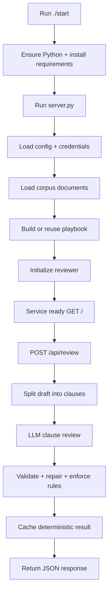

# testlitmus / precedent — Detailed Simple Explanation (In-Depth)

This document explains the repository, assignment goal, architecture, file purposes, and full runtime behavior in plain language, deeply but clearly.

---

## 1) What this repository is

This repository contains a Litmus assessment solution named **Precedent**.

In simple terms, this project builds a legal AI workflow that does two jobs:

1. Learns a firm's **real negotiation behavior** from historical legal files.
2. Reviews a **new incoming contract** clause-by-clause and returns a clear decision for each clause.

Each clause decision must be exactly one of:
- `accept`
- `counter`
- `escalate`

So this is not just text summarization — it is structured legal decisioning with evidence.

---

## 2) What problem statement asked you to build

The assignment (`/home/runner/work/testlitmus/testlitmus/precedent/README.md`) asks for a 2-stage system.

### Stage 1 — Build playbook from corpus
On startup, the service must read all files in `/home/runner/work/testlitmus/testlitmus/precedent/corpus` and derive how that law firm actually negotiates:
- default language
- accepted fallbacks
- never-accept positions
- escalation routes
- conflicts and resolution basis

Then persist that playbook under `/home/runner/work/testlitmus/testlitmus/precedent/playbook`.

### Stage 2 — Review new draft against generated playbook
The service must accept a contract draft and produce per-clause output where each clause gets one decisive disposition (`accept`, `counter`, `escalate`) with rationale and corpus-file citations.

### Hard constraints from assignment
- No hardcoded legal positions.
- All decisions grounded in corpus documents.
- Citations must map to real corpus filenames.
- Deterministic review behavior.
- HTTP service with readiness and review endpoints.

---

## 3) What you built (actual implementation)

You built a Python service with these major modules:

- `/home/runner/work/testlitmus/testlitmus/precedent/server.py`  
  API surface and orchestration.

- `/home/runner/work/testlitmus/testlitmus/precedent/corpus.py`  
  Corpus ingestion and format normalization.

- `/home/runner/work/testlitmus/testlitmus/precedent/playbook.py`  
  Stage 1 playbook derivation, persistence, fingerprinting, markdown rendering.

- `/home/runner/work/testlitmus/testlitmus/precedent/reviewer.py`  
  Stage 2 clause segmentation, LLM review, validation/repair, rule enforcement, deterministic cache.

- `/home/runner/work/testlitmus/testlitmus/precedent/llm.py`  
  OpenAI-compatible client wrapper with model discovery, retry, and JSON extraction.

- `/home/runner/work/testlitmus/testlitmus/precedent/config.py`  
  Environment configuration, paths, credential validation.

- `/home/runner/work/testlitmus/testlitmus/precedent/start`  
  Boot script for environment setup and server start.

---

## 4) End-to-end runtime flow



---

## 5) Deep dive — Stage 1 playbook generation

Stage 1 is the foundational intelligence-building step.

### 5.1 Corpus loading (`corpus.py`)
`load_corpus(corpus_dir)` recursively scans files and converts each file to text.

Supported formats:
- `.txt`, `.md` via text read
- `.csv` via CSV reader, row-joined text
- `.pdf` via `pypdf.PdfReader` extraction
- `.xlsx/.xls` via `openpyxl` sheet/row extraction

For each readable file:
- `citation` = relative path under corpus (used in evidence)
- `category` = parent folder name (`deals`, `memos`, etc.)
- `text` = normalized text content

Output is `Document(citation, category, text)` list.

### 5.2 Corpus fingerprinting (`playbook.py`)
`corpus_fingerprint()` hashes every document path + content and returns a short digest.

Why needed:
- if corpus hasn’t changed, reuse existing playbook
- if corpus changed, regenerate playbook

### 5.3 Playbook generation prompt strategy
`playbook.py` sends all corpus files into a structured prompt with strict JSON schema requirements.

Prompt instructions enforce:
- derive from corpus only
- prefer actual signed/approved behavior over stale docs when conflicts exist
- include evidence for every claim
- include standard, fallback, never-accept, escalation, conflicts, notes

### 5.4 Post-generation sanitation
After LLM returns playbook JSON:
- evidence lists are filtered to known corpus citations only
- malformed structures normalized

### 5.5 Persistence
Writes:
- `/home/runner/work/testlitmus/testlitmus/precedent/playbook/playbook.json`
- `/home/runner/work/testlitmus/testlitmus/precedent/playbook/PLAYBOOK.md`

So playbook is both machine-readable and human-readable.

---

## 6) Deep dive — Stage 2 contract review

Stage 2 applies learned policy to new drafts.

### 6.1 Input contract ingestion
`POST /api/review` receives JSON:

```json
{"contract": "<full contract text>"}
```

Invalid JSON or empty contract returns `400`.

### 6.2 Clause segmentation
`segment_clauses()` detects numbered headings like `3. FEES AND PAYMENT` and slices body text per clause.

If headings are not recognized, fallback is single clause: `Contract`.

### 6.3 LLM review call
Reviewer prompt includes:
- full generated playbook
- exact allowed corpus citation filenames
- pre-segmented clauses
- strict required output schema

Model must output per clause:
- clause identifier
- disposition
- rationale
- proposed language (required for `counter`)
- citations
- approval note

### 6.4 Multi-layer post-processing guardrails
Raw model output is not trusted directly.

#### A) `_validated()`
Drops invalid entries if:
- disposition not allowed
- rationale missing
- `counter` without language

Also filters citations to known corpus files only.

#### B) `_repair()`
If clauses were broken/missing/uncited, sends a correction prompt requesting fixed entries.

#### C) `_cover_gaps()`
If some clauses still have no entry, force-fill with fallback:
- disposition: `escalate`
- rationale: playbook unclear / missing coverage

This ensures every clause gets exactly one disposition.

#### D) `_force_never_accept()`
For absolute never-accept topics (e.g., “never in any form”), overrides non-escalate output to `escalate`, injects evidence and warning note.

### 6.5 Determinism and cache
Cache key = hash(playbook_fingerprint + contract_text).  
Stored in `review_cache` as JSON.

Effect:
- same playbook + same contract => same returned response object
- faster repeat reviews

---

## 7) API contract and behavior

### `GET /`
Readiness endpoint. Returns:
- status
- service name
- active model
- playbook fingerprint
- number of playbook topics

### `POST /api/review`
Runs full review pipeline and returns:
- `summary`
- `overall_counts` for `accept/counter/escalate`
- ordered clause entries
- `playbook_fingerprint`

---

## 8) Why this architecture is necessary

This architecture directly addresses assignment risks:

1. **LLM hallucination risk** → constrained schemas + citation filtering + repair logic.
2. **Inconsistent guidance in corpus** → prompt requires conflict handling and evidence hierarchy.
3. **Need deterministic grading** → temperature 0 + cache keying.
4. **Need explainability for legal users** → explicit rationale + citations + approval notes.
5. **Need reproducibility** → startup playbook generation from current corpus.

---

## 9) File-by-file explanation (full map)

## Repository root
- `/home/runner/work/testlitmus/testlitmus/precedent/`  
  Primary solution package.
- `/home/runner/work/testlitmus/testlitmus/precedent_submission.zip`  
  Submission artifact.
- `/home/runner/work/testlitmus/testlitmus/REPO_DETAILED_EXPLANATION.md`  
  This explanatory document.
- `/home/runner/work/testlitmus/testlitmus/_verify.py`, `_verify2.py`  
  Local validation helpers for review behavior.
- `/home/runner/work/testlitmus/testlitmus/_rerender.py`  
  Regenerates markdown playbook from saved JSON.

## Core package: `/home/runner/work/testlitmus/testlitmus/precedent`
- `README.md` → assessment specification.
- `RUNBOOK.md` → quick run instructions.
- `LITMUS-AI-NOTICE.md` → AI capture/tracking guidance file.
- `start` → executable startup entry.
- `validate.sh` → grading-shape local validator.
- `requirements.txt` → dependency list.
- `config.py` → env loading + constants + credential checks.
- `corpus.py` → corpus ingestion/parsing layer.
- `llm.py` → LLM transport abstraction and JSON extraction.
- `playbook.py` → Stage 1 build/reuse/store and markdown renderer.
- `reviewer.py` → Stage 2 review logic and protections.
- `server.py` → HTTP endpoints and process lifecycle.
- `tests/test_offline.py` → non-network unit tests.

## Data directories
- `/home/runner/work/testlitmus/testlitmus/precedent/corpus/template`  
  Standard baseline form text.
- `/home/runner/work/testlitmus/testlitmus/precedent/corpus/deals`  
  Executed agreements (best evidence of accepted practice).
- `/home/runner/work/testlitmus/testlitmus/precedent/corpus/redlines`  
  Negotiation turns (counterparty vs firm counter).
- `/home/runner/work/testlitmus/testlitmus/precedent/corpus/memos`  
  Internal legal policy memos.
- `/home/runner/work/testlitmus/testlitmus/precedent/corpus/policies`  
  approvals log + older matrix.
- `/home/runner/work/testlitmus/testlitmus/precedent/inbound`  
  sample drafts for testing stage-2 behavior.
- `/home/runner/work/testlitmus/testlitmus/precedent/playbook`  
  generated stage-1 output artifacts.
- `/home/runner/work/testlitmus/testlitmus/precedent/review_cache`  
  runtime-generated deterministic review cache.

---

## 10) Internal component interaction diagram

```mermaid
graph LR
    subgraph Inputs
      CORPUS[corpus/*]
      DRAFT[contract text]
      ENV[LITMUS_AI_BASE_URL + LITMUS_AI_API_KEY]
    end

    CFG[config.py]
    INGEST[corpus.py]
    LLM[llm.py]
    PB[playbook.py]
    RV[reviewer.py]
    API[server.py]

    PLAYBOOK_OUT[playbook/playbook.json + PLAYBOOK.md]
    CACHE[review_cache/*.json]
    REVIEW_OUT[/api/review JSON]

    ENV --> CFG --> API
    CORPUS --> INGEST --> PB
    LLM --> PB
    PB --> PLAYBOOK_OUT
    PLAYBOOK_OUT --> RV
    DRAFT --> RV
    LLM --> RV
    RV --> CACHE
    RV --> API --> REVIEW_OUT
```

---

## 11) Example clause journey (end-to-end understanding)

Take a clause in inbound draft: **Fees and Payment**

1. Clause segmentation detects `3. FEES AND PAYMENT`.
2. Reviewer prompt gives model:
   - this clause text
   - playbook standard position (e.g., net 30)
   - approved fallbacks (e.g., net 45 / net 60 with conditions)
3. Model decides disposition based on clause text and fallback conditions.
4. Post-processing checks output validity.
5. If citations invalid, they are removed; repair may re-request proper citation.
6. Final clause output includes one disposition + rationale + valid citations + approval note.

This same pattern applies to every clause.

---

## 12) Validation and reliability coverage

`tests/test_offline.py` verifies:
- corpus loaders can parse txt/pdf/xlsx
- clause segmentation works on inbound drafts
- invalid review entries are repaired
- every clause gets a disposition
- review caching works
- API endpoints behave correctly

`validate.sh` additionally verifies delivery contract expectations:
- `./start` exists/executable
- service becomes ready within limit
- `./playbook` generated at boot
- review endpoint returns non-empty response

---

## 13) Practical summary

You built a deterministic legal review service that:
- extracts negotiation policy from historical files,
- generates durable playbook artifacts,
- applies those policies to new contracts clause-by-clause,
- produces explainable decisions with corpus evidence,
- and enforces strict output correctness before returning results.

---

## 14) One-line final understanding

This project is an evidence-grounded, production-shaped miniature of a legal contract negotiation assistant that learns from prior firm behavior and returns deterministic, auditable clause dispositions on new drafts.
