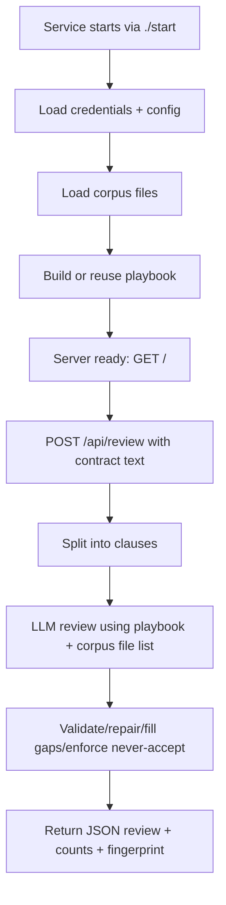
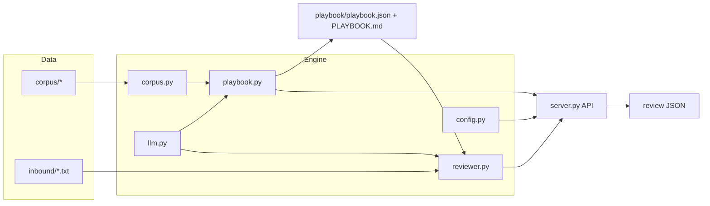

# testlitmus / precedent — Detailed Simple Explanation

## 1) What this repository is

This repo contains a solution for a Litmus assessment called **Precedent**.

In simple terms, it builds a small legal AI system that:
1. **Reads a law firm's historical contract files**
2. **Builds a negotiation playbook** from those files
3. **Reviews a new incoming contract** using that playbook
4. For each clause, gives exactly one decision: **accept**, **counter**, or **escalate**

---

## 2) What question/problem statement was asked

From the assignment (`precedent/README.md`), the required task is:

- **Stage 1:** Generate a playbook from `./corpus` at startup
- **Stage 2:** Expose an API endpoint that reviews incoming contract text against the playbook
- Must cite corpus filenames as evidence
- Must be deterministic (same input → same output)
- Must run as a service with:
  - `GET /` readiness
  - `POST /api/review` review endpoint

So the core question was:  
**“Can you turn past agreements and internal files into a reusable negotiation playbook, then apply it to new drafts in a structured and evidence-backed way?”**

---

## 3) What was built (high-level)

A Python HTTP service (`precedent/server.py`) with these components:

- **Corpus loader** (`corpus.py`)  
  Reads TXT/MD/CSV/PDF/XLSX and normalizes into text documents with citations.

- **LLM client** (`llm.py`)  
  Connects to OpenAI-compatible endpoint from env vars.

- **Playbook generator** (`playbook.py`)  
  Uses LLM + all corpus docs to build structured playbook JSON and markdown artifact.

- **Contract reviewer** (`reviewer.py`)  
  Splits contract into clauses, asks LLM for clause-by-clause dispositions, validates/repairs output, enforces strict rules, caches deterministic responses.

- **Service layer** (`server.py`)  
  Starts everything, serves API.

- **Startup script** (`start`)  
  Creates venv if needed, installs dependencies, runs server.

---

## 4) End-to-end workflow



---

## 5) Stage 1 (playbook generation) — how it works

1. `corpus.load_corpus()` recursively reads all files under `precedent/corpus/`
2. Each file becomes a `Document(citation, category, text)`
3. `playbook.load_or_build()` computes a **corpus fingerprint**
4. If existing playbook fingerprint matches, reuse it
5. Else call LLM to build playbook topics with:
   - standard position/language
   - approved fallbacks
   - never-accept rules
   - escalation rules
   - conflicts + resolutions
6. Save to:
   - `precedent/playbook/playbook.json`
   - `precedent/playbook/PLAYBOOK.md`

---

## 6) Stage 2 (contract review) — how it works

1. Receive contract text at `POST /api/review`
2. `segment_clauses()` detects numbered headings (e.g., `8. LIMITATION OF LIABILITY`)
3. LLM returns structured JSON for each clause
4. Reviewer applies guardrails:
   - only allow dispositions: `accept|counter|escalate`
   - `counter` must include proposed language
   - citations must be valid corpus filenames
   - attempt repair if response is malformed/incomplete
   - fill missing clauses as `escalate`
   - force escalation for absolute never-accept topics
5. Cache by `(playbook_fingerprint + contract_text)` hash for deterministic repeat outputs

---

## 7) API behavior

### `GET /`
Returns readiness metadata (status, model, playbook fingerprint, topic count).

### `POST /api/review`
Input:

```json
{"contract": "<full draft text>"}
```

Output contains:
- summary
- overall disposition counts
- clause entries with disposition, rationale, proposed language, citations, approval note
- playbook fingerprint

---

## 8) File-by-file explanation

## Repository root

- `precedent/` → main project (actual deliverable code)
- `_verify.py`, `_verify2.py` → local verification/debug scripts
- `_rerender.py` → regenerates `PLAYBOOK.md` from stored JSON
- `precedent_submission.zip` → packaged submission artifact

## `precedent/` main code

- `README.md` → assignment statement + requirements
- `RUNBOOK.md` → how to run locally
- `LITMUS-AI-NOTICE.md` → Litmus capture/tracking notice
- `config.py` → paths, env loading, credentials, port
- `corpus.py` → read/normalize corpus file formats
- `llm.py` → model discovery, retries, JSON extraction
- `playbook.py` → Stage 1 logic + playbook persistence/markdown rendering
- `reviewer.py` → Stage 2 review logic + clause segmentation + caching + guardrails
- `server.py` → HTTP server and endpoint handlers
- `start` → boot script that installs deps and launches service
- `requirements.txt` → python dependencies (`httpx`, `pypdf`, `openpyxl`)
- `validate.sh` → official local contract-check script matching grading shape
- `tests/test_offline.py` → offline unit tests for corpus, segmentation, review behavior, caching, API
- `playbook/` → generated output artifact (JSON + markdown playbook)
- `review_cache/` (created at runtime) → cached review results

## `precedent/corpus/` data used as source of truth

- `template/` → standard contract form baseline
- `deals/` → executed agreements (actual accepted terms)
- `redlines/` → negotiation drafts and counters
- `memos/` → internal legal policy/positions/decisions
- `policies/approvals_log.csv` → explicit deviations and approvals
- `policies/clause_matrix_2023.xlsx` → older policy matrix (may conflict with newer evidence)

## `precedent/inbound/`

- sample incoming contracts to test review behavior

---

## 9) Design choices and why they are necessary

- **Evidence-first citations**: required by assignment; improves traceability.
- **Strict disposition vocabulary**: required hard rule.
- **Determinism via cache + temperature 0**: required by assignment.
- **Conflict handling in playbook prompt**: needed because corpus docs can disagree.
- **Startup playbook derivation**: required (cannot hardcode positions).

---

## 10) Internal architecture diagram



---

## 11) In one sentence

You built a deterministic, evidence-citing legal contract review service that learns negotiation positions from a firm's historical corpus and applies them clause-by-clause to new drafts.
